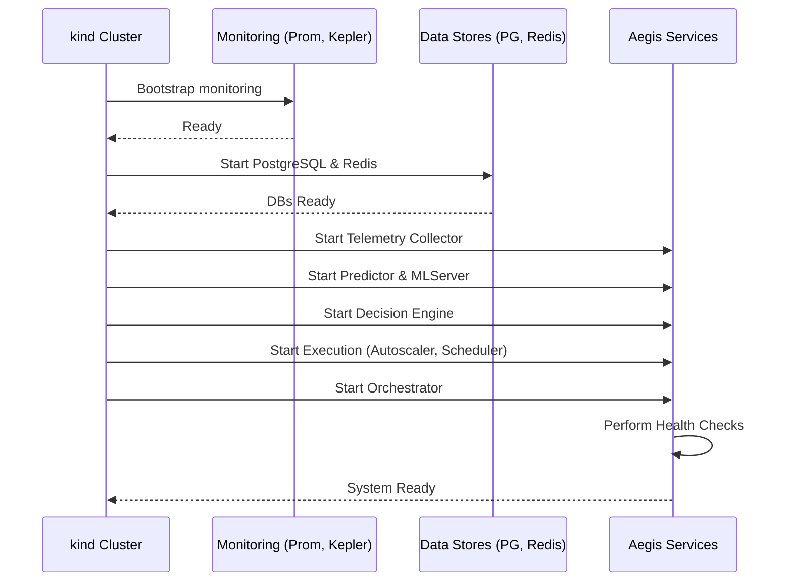
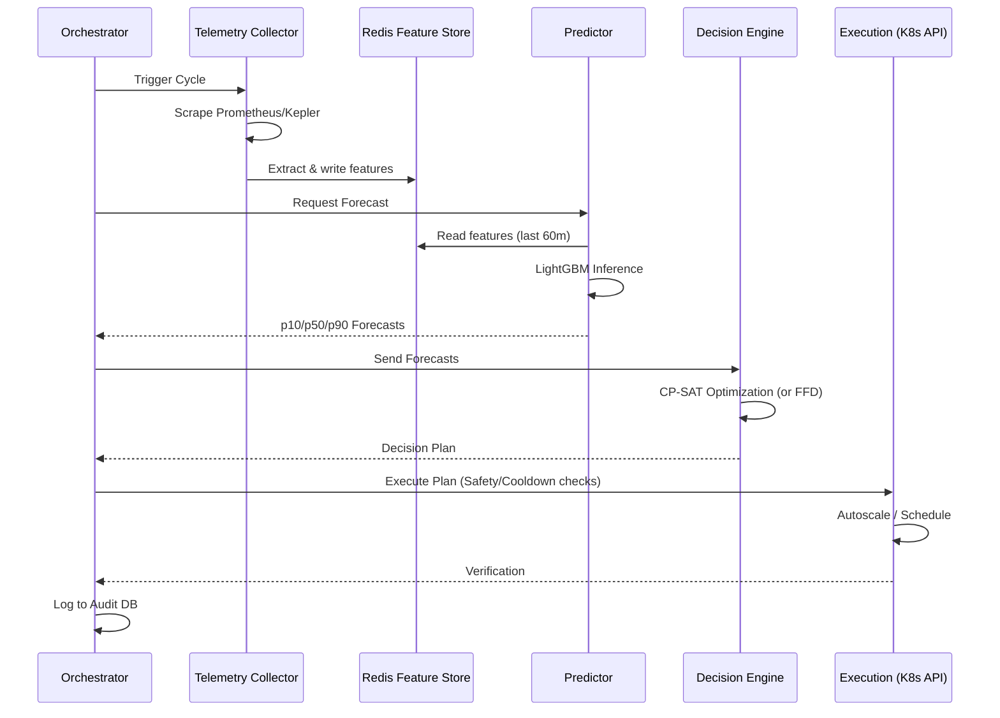
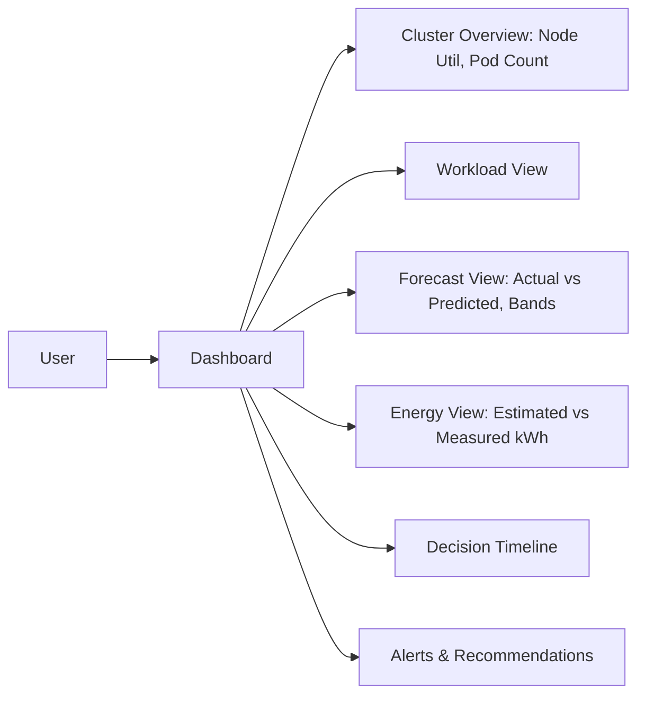
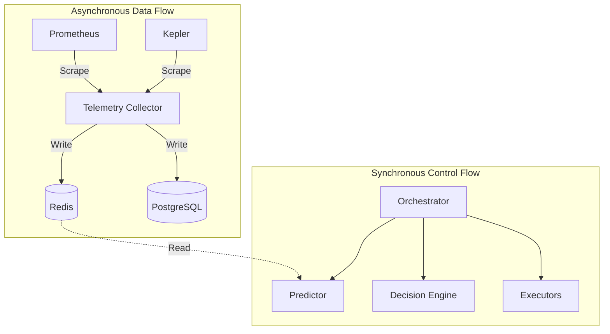

# System Flow Document

## 1. Startup Flow

## 2. Control-Loop Flow (30-60s Cycle)

## 3. Failure Flows

- **Predictor Fails:** The orchestrator retrieves the last valid prediction from the cache and uses it.
- **Redis Unavailable:** System degrades gracefully; relies on raw Prometheus queries temporarily if possible, else skips cycle.
- **PostgreSQL Unavailable:** Audit logs and historical decisions are buffered in memory/Redis until the DB returns.
- **CP-SAT Timeout:** Orchestrator catches the timeout and immediately executes the First-Fit Decreasing (FFD) fallback heuristic.
- **K8s API Unavailable:** Execution controllers implement exponential backoff retry. Failures are recorded.
- **Scheduler Plugin Unavailable:** Kubernetes falls back to the default scheduler.
- **Kepler Unavailable:** Energy model defaults to theoretical estimation formulas without runtime calibration.
- **Stale Telemetry:** If data timestamp > threshold, cycle is aborted to prevent bad decisions.
- **Full Aegis Failure:** Aegis controllers pause; Kubernetes native HPA resumes control based on CPU/Mem.

## 4. Dashboard & User Flow

## 5. Data Flow Diagram

