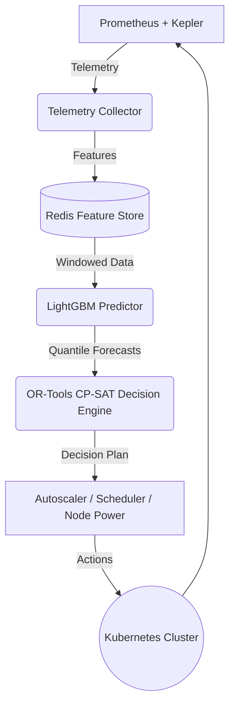

# Aegis

Coupling Quantile Workload Forecasting with Energy-Aware Scheduling and Autoscaling for Kubernetes Clusters — a closed-loop AI-driven Kubernetes orchestration system.

## Overview
Aegis aims to bridge the gap between reactive autoscaling and energy-aware resource optimization in Kubernetes. By leveraging quantile forecasting (LightGBM) and a joint constraint programming optimizer (OR-Tools CP-SAT), Aegis preemptively scales workloads and schedules pods to minimize energy waste and SLA violations.

## Why it exists
- **Reactive HPA lag:** Standard Kubernetes autoscaling is reactive, leading to latency spikes before scaling up and wasted resources before scaling down.
- **Energy Waste:** Clusters often run under-utilized, wasting energy.
- **Coupling Gap:** Autoscaling and scheduling are traditionally decoupled, leading to sub-optimal placement decisions and missed opportunities for consolidation.

## Architecture



## Repository Structure
```
aegis/
├── datasets/            # Datasets and traces
├── docs/                # Documentation
├── ml/                  # Machine learning pipeline and models
├── services/            # Microservices
│   ├── api-gateway/
│   ├── autoscaler/
│   ├── decision-engine/
│   ├── energy-module/
│   ├── node-power/
│   ├── orchestrator/
│   ├── predictor/
│   ├── recommendation/
│   └── telemetry-collector/
├── scheduler-plugin/    # Go scheduler plugin
├── docker-compose.yml
├── Makefile
├── README.md
└── CONTRIBUTING.md
```

## Prerequisites
- Docker & Docker Compose
- kind (Kubernetes in Docker)
- kubectl
- Python 3.11
- Go 1.21+
- Helm

## Local Setup
1. Clone the repository
2. Copy `.env.example` to `.env` and fill in secrets
3. Run `make setup` to start the kind cluster and deploy infrastructure
4. Run `make services-up` to build and deploy the Aegis microservices

## Control Loop (4 Stages)
1. **Monitor:** Telemetry collector gathers metrics from Prometheus and Kepler.
2. **Forecast:** Predictor generates quantile workload forecasts using LightGBM.
3. **Optimize:** Decision Engine formulates a CP-SAT problem for joint scaling and scheduling.
4. **Execute:** The generated plan is executed by the Autoscaler Controller and Scheduler Plugin.

## Testing and Development
- `make test`: Run all tests (Python + Go)
- `pytest`: Run Python tests
- `go test`: Run Go tests
- See [CONTRIBUTING.md](CONTRIBUTING.md) for contribution guidelines.

## Roadmap & Status
Currently in Phase 1 (Foundations).
See `docs/IMPLEMENTATION_STATUS.md` for details.
