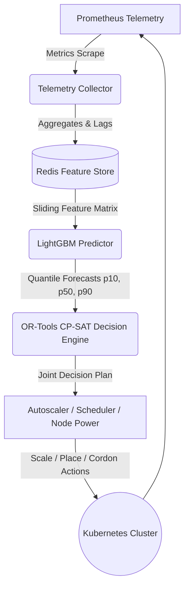

# Aegis

**Aegis** is a closed-loop, AI-driven Kubernetes orchestration research system that couples multi-horizon quantile workload forecasting (LightGBM $p_{10}, p_{50}, p_{90}$) with joint constraint optimization (OR-Tools CP-SAT) and a custom Go scheduler plugin. It scales replica counts proactively, packs pods onto energy-efficient nodes, and power-manages idle infrastructure ahead of demand shifts, under hard safety guards (dead zone, cooldown, minimum active nodes). Its empirical claims in this README come from one frozen trace-replay simulator evaluated on the Azure Functions 2019 production serverless trace.

---

## 1. Scope and Status Box

| | |
| :--- | :--- |
| **What is measured** | Conformal forecast coverage, cluster energy (kWh), capacity shortfall (minutes), and scaling actions for Aegis vs. a Cluster-Autoscaler-style reactive baseline and other arms, by replaying recorded workload traces through a frozen, unit-tested simulator (`ml/evaluation/ablation.py`). |
| **What is a simulation** | **Every energy number in this README** comes from an analytical power model $P_i(u_i) = P_{idle,i} + (P_{max,i} - P_{idle,i})\,u_i^{\alpha}$ with 3-minute node boot transitions and a $K_{\min} = 2$-node floor. No physical power meter, IPMI, or Kepler measurement is involved anywhere. |
| **What is not done** | Live hardware/Kepler energy validation (`services/energy-module/kepler.py` is an unintegrated stub); a blind evaluation on the reserved expanded-test partition (W4 — pending); online closed-loop deployment on a physical cluster. |

## 2. Honest Limitations (Read Before Citing Any Number)

- **All energy is analytical simulation.** No live physical hardware or Kepler measurement has been performed; `services/energy-module/kepler.py` is an unintegrated stub (see `docs/threats_to_validity.md` §3).
- **Demand cores are derived, not measured CPU.** Per-minute cores are computed from Azure serverless invocation counts times the *daily mean* execution duration times an assumed 1.0 vCPU per concurrent execution: $\text{cores}(app,t) = \sum_f \text{invocations}(f,t) \times \overline{\text{dur}}_s(f,\text{day}) / 1000 / 60 \times 1.0$. Real I/O-bound functions typically use less than 1.0 vCPU; daily duration averaging hides intraday latency variance (see `docs/threats_to_validity.md` §1).
- **Single trace, heavy filtering.** One 14-day production trace (Azure Functions 2019, July 2019). Only 411 of 24,274 raw applications (1.69%) pass the 4-stage eligibility filter, so results describe continuously active, medium-to-large workloads — not the dormant serverless long tail.
- **The 20 validation apps are not blind.** They were used for design decisions, parameter sweeps, and calibration-method selection under the Split Protocol. Results on them are development-set results. The zero-touch blind evaluation on the reserved expanded-test partition (W4) has not been run; until then no generalization claim beyond these 20 apps is supported.

## 3. Architecture and Repository Layout

Aegis couples multi-horizon quantile workload forecasting (LightGBM $p_{10}, p_{50}, p_{90}$) with joint constraint optimization (OR-Tools CP-SAT) and a custom Kubernetes scheduler plugin to scale replicas, pack pods onto energy-efficient nodes, and power-manage idle nodes ahead of demand shifts. An autonomous orchestrator loop closes the cycle: Prometheus telemetry → Redis feature store → LightGBM predictor → CP-SAT decision engine → autoscaler/scheduler/node-power actuation.


```mermaid
graph TD
    A[Prometheus Telemetry] -->|Metrics Scrape| B(Telemetry Collector)
    B -->|Aggregates & Lags| C[(Redis Feature Store)]
    C -->|Sliding Feature Matrix| D(LightGBM Predictor)
    D -->|Quantile Forecasts p10, p50, p90| E(OR-Tools CP-SAT Decision Engine)
    E -->|Joint Decision Plan| F[Autoscaler / Scheduler / Node Power]
    F -->|Scale / Place / Cordon Actions| G((Kubernetes Cluster))
    G --> A
```

```
aegis-cloud/
├── configs/                 # System, quantile, and solver configurations
├── datasets/                # Azure Functions 2019 dataset, checksums, loaders, preprocessing
├── docs/                    # Architecture, decisions log, threats to validity, status
├── eval/                    # Evaluation harnesses, results JSONs, generated reports
├── infrastructure/          # kind cluster, Prometheus, Grafana, Kepler manifests, TimescaleDB
├── ml/                      # LightGBM quantile models, features, frozen ablation simulator
├── scheduler/aegis-scheduler/  # Native Go Kubernetes scheduler plugin (Filter+Score)
├── services/                # api-gateway, autoscaler-controller, decision-engine,
│   │                        # energy-module (kepler.py = stub), node-power-controller,
│   │                        # orchestrator, predictor, recommendation-engine, shared,
│   │                        # telemetry-collector
├── dashboard/web/v2/        # Offline zero-dependency evaluation viewer (port 8080)
├── tests/                   # Python + Go unit, integration, and e2e suites
├── Makefile                 # make readme | test | infra-up | services-up | ...
├── PRD.md / TRD.md          # Product and technical requirement specifications
└── README.md                # This file (generated by eval/generate_readme.py)
```

Every path above is verified to exist by `eval/generate_readme.py` at build time.

## 4. Evaluation Protocol

### 4.1 Workload selection (Azure Functions 2019)

Applications are filtered from the raw trace by a deterministic 4-stage waterfall
(Source: `eval/app_selection.md` §3, "Filter Cascade & Drop Accounting"; 14-day trace = 14 days):

| Stage | Criterion | Apps passing | Apps dropped |
| :--- | :--- | ---: | ---: |
| Raw universe | — | 24,274 | 0 |
| 1 | Observation span ≥ 7 days | 17,000 | 7,274 |
| 2 | Missing minutes < 5.0% | 13,057 | 3,943 |
| 3 | Peak demand ≤ 68.0 cores | 12,700 | 357 |
| 4 | Mean demand ≥ 0.50 cores | 411 | 12,289 |

From the 411 eligible applications, 60 are sampled with fixed seed 42 and partitioned strictly by application identity (Source: `eval/sixty_app_study_results.json`, `configuration`): **30 train** (LightGBM quantile training), **10 calibrate** (conformal residuals), **20 validation**. The 20 validation apps are the evaluation set for every number below. They are *not* a blind test set (see §2). A further expanded-test partition is reserved for the pending W4 evaluation and was not touched by any study here.

### 4.2 Simulator invariants

(Source: `eval/sixty_app_study_results.json` → `configuration`; `eval/headline_results_v5.json` and `eval/baselines_results_v1.json` → `configuration.energy_floor_kwh`; node power from `ml/evaluation/ablation.py::get_default_nodes(scale="large")`.)

- Cluster: 20 nodes × 4.0 cores/node × 0.85 allocatable = 68.0 allocatable cores.
- Node power (per-node heterogeneous, not uniform): $P_{idle}$ = 88–111.2 W, $P_{max}$ = 240–280 W, exponent $\alpha$ = 0.6696. Note: several project documents describe a nominal "P_idle = 100 W, P_max = 300 W" profile; the committed code implements the heterogeneous ranges above (see `docs/README_regen_discrepancies.md`, item h).
- Guards: 10% scale dead zone, 300 s scale cooldown, 3-minute node wake-up latency, $K_{\min}$ = 2 minimum active nodes.
- Energy floor: 62.40 kWh = $K_{\min} \times$ 100 W × 312 h — energy at or below the two-idle-node floor is reported separately as "above floor".
- Scored evaluation window: 18,720 minutes (13.0 days) of the 14-day trace (the first day is feature warm-up).
- Statistics: paired bootstrap 95% CIs with B = 10,000, Wilcoxon signed-rank tests with Holm–Bonferroni correction within each comparison family.

### 4.3 Frontier grids

CA target utilizations: 18 points (0.10–0.95); Aegis quantile levels $\tau$: 13 points (0.30–0.999); shortfall targets: 4 (0.0%, 0.1%, 1.0%, 5.0%); study arms: 7. Each (utilization × τ × app) pairing is a frontier evaluation point: 4,680 per target across the 20 validation apps. The original narrower v1 grid (6 × 6 points) is retained as a subset (Decision D-5).

**Superseded result files:** `eval/scale_aware_pareto_results.json` (v1), `eval/scale_aware_pareto_results_v3.json` (v3), and `eval/headline_results_v4.json` (v4) are superseded by `eval/headline_results_v5.json` per Decision D-10 and feed **no** number in this README.

## 5. Headline Result — Matched-Shortfall Energy (v5)

**Primary comparison**: Aegis with per-app rolling conformal calibration (W = 1440, H = 10; primary arm per Decision D-7) vs. Cluster Autoscaler (CA), at the **primary 1.0% shortfall target** (187.2 min of the 18,720-minute window; lowest extrapolation rate per Decision D-6).
ΔE = $E_{\text{Aegis}} - E_{\text{CA}}$ per app; negative = Aegis cheaper. "Mean ΔE" is the all-app mean paired difference; "median" columns are marginal medians.

At the 1.0% target (Source: `eval/headline_results_v5.json` → `matched_shortfall_pareto['1.0%']['rolling']`; Wilcoxon fields cross-checked identical in `eval/baselines_results_v1.json` → same path):

- CA median energy: 121.79 kWh; Aegis median energy: 86.92 kWh; difference of medians: -34.87 kWh.
- **Mean paired ΔE: -75.13 kWh, 95% bootstrap CI [-132.46, -26.96]** — the CI excludes zero.
- Apps cheaper with Aegis: 70.0% (14 of 20).
- Extrapolation: CA frontier interpolated at target for 6/20 apps (4 below-min, 2 above-max); Aegis for 6/20 apps (0 below-min, 6 above-max). Degenerate Aegis frontiers: 2/20.
- **Wilcoxon two-sided p = 0.00944; Holm–Bonferroni-adjusted (across 7 arms at this target) p = 0.066.** Stated plainly: the bootstrap CI excludes zero, but the Holm-adjusted p is above 0.05, so the rank-based paired test with family correction does **not** reach the 0.05 threshold. Both facts are reported; neither alone is the result.

### 5.1 Secondary and supplementary targets (primary arm, rolling conformal)

(Source: `eval/headline_results_v5.json` → `matched_shortfall_pareto[<target>]['rolling']`; Holm-adjusted p from `eval/baselines_results_v1.json` → same path, correction across the 7 study arms at each target.)

| Target | Role | CA median (kWh) | Aegis median (kWh) | Mean ΔE (kWh) [95% CI] | Cheaper | Holm-adj. p |
| :--- | :--- | ---: | ---: | :--- | ---: | ---: |
| 0.1% | Secondary (strict SLA) | 159.71 | 125.73 | -66.77 [-132.38, -12.69] | 65.0% | 0.319 |
| 1.0% | **Primary** | 121.79 | 86.92 | -75.13 [-132.46, -26.96] | 70.0% | 0.066 |
| 5.0% | Supplementary (upper bound) | 90.88 | 79.75 | -57.18 [-105.34, -16.09] | 55.0% | 0.922 |

At the 0.1% and 5.0% targets the mean-ΔE CIs again exclude zero while the Holm-adjusted p-values (0.319 and 0.922) exceed 0.05; the same plain statement applies. The 0.0% target (zero shortfall) is **extrapolation-dominated**: CA requires frontier extrapolation for 10/20 apps and Aegis for 12/20 apps, and every remaining extrapolation is below the minimum achievable shortfall (target 0 min < minimum observed shortfall on bursty apps). Its numbers (mean ΔE -133.30 [-202.78, -68.16], Holm-adj. p 0.00407) are shown for completeness only and should not be read as a robust operating point. Source: `matched_shortfall_pareto['0.0%']['rolling']`.

## 6. Natural Operating Point ($\tau$ = 0.90 vs. CA U = 50% / 60%)

Aegis running at its nominal quantile $\tau$ = 0.90 against CA at industrial-style utilization targets — the comparison without frontier interpolation.
(Source: `eval/headline_results_v5.json` → `natural_operating_points['rolling'][ca_u_50 | ca_u_60]`.)

| CA target | CA median energy (kWh) | Aegis median energy (kWh) | Mean ΔE (kWh) [95% CI] | CA median shortfall (min) | Aegis median shortfall (min) | Mean Δ shortfall (min) [95% CI] | Holm-adj. p |
| :--- | ---: | ---: | :--- | ---: | ---: | :--- | ---: |
| U = 50% | 127.35 | 76.20 | -29.51 [-44.89, -15.60] | 74.0 | 65.5 | -404.50 [-877.66, -30.64] | 0.00355 |
| U = 60% | 117.06 | 76.20 | -15.77 [-31.00, 0.28] | 164.0 | 65.5 | -569.90 [-1058.55, -172.84] | 0.0319 |

Read the shortfall columns: at $\tau$ = 0.90 Aegis does **not** achieve zero shortfall (median 65.5 min per app at U = 50%; mean paired shortfall reduction -404.50 min). At U = 60% the mean energy ΔE CI is [-31.00, 0.28], which includes zero, while the Holm-adjusted p is 0.0319 (below 0.05); both are reported as-is.

## 7. Baselines and Component Ablations (Task W3)

Paired comparison of the primary rolling-conformal Aegis arm against each alternative arm at matched shortfall targets.
ΔE = $E_{\text{Aegis rolling}} - E_{\text{arm}}$ per app; **positive = Aegis costs more than that arm**.
(Source: `eval/baselines_results_v1.json` → `matched_shortfall_pareto[<target>]['vs_primary_aegis_rolling'][<arm>]`; degenerate-frontier counts from the corresponding arm block. p-values are unadjusted two-sided Wilcoxon; the committed file does not store a Holm correction for this comparison family.)

| Arm | ΔE @ 0.1% (kWh) [95% CI] | ΔE @ 1.0% (kWh) [95% CI] | p @ 0.1% | p @ 1.0% | Degenerate frontiers (0.1% / 1.0%) |
| :--- | :--- | :--- | ---: | ---: | :---: |
| LightGBM point (p50) + rolling conformal | 5.42 [-7.95, 25.13] | 5.93 [-4.66, 23.52] | 0.601 | 0.904 | 2 / 2 |
| Holt-Winters + rolling conformal | 3.36 [-15.09, 26.41] | 3.49 [-11.35, 24.32] | 0.601 | 0.409 | 1 / 1 |
| Fixed margin (raw p90 + 8.6468-core sweep) | 18.35 [-10.71, 49.40] | 2.78 [-15.19, 20.25] | 0.245 | 0.571 | 1 / 1 |
| Seasonal naive + rolling conformal | -11.37 [-23.79, 2.90] | -12.23 [-23.79, -0.26] | 0.0073 | 0.0441 | 1 / 1 |
| Quantile linear + rolling conformal | -35.72 [-56.72, -16.78] | -54.60 [-79.13, -32.09] | 0.00148 | 0.000132 | 6 / 6 |
| No CP-SAT (spreading placement) | -12.35 [-19.40, -5.46] | -9.70 [-15.36, -4.41] | 0.00486 | 0.0073 | 2 / 2 |

**What this does and does not show (N = 20 per comparison; CIs are bootstrap percentile intervals):**

- The LightGBM quantile arm is **statistically indistinguishable** from point forecast (p50) + conformal, Holt-Winters + conformal, and a fixed margin at both matched targets: all three CIs include zero (e.g. 5.93 [-4.66, 23.52] at 1.0%). With N = 20, equivalence is not proven either — the study cannot tell these forecasters apart on matched-shortfall energy.
- The **CP-SAT placement stage has a measurable effect**: with the joint-placement optimizer bypassed (`no_cpsat_ffd`, replaced by even-spreading placement), the arm's energy sits 9.70 kWh [4.41, 15.36] above the primary Aegis arm at the 1.0% target — a CI that excludes zero.
- The conformal wrapper's measurable effect is **coverage control** (§8: rolling calibration holds median coverage near the 90% nominal level where the raw $p_{90}$ under-covers at 86.8%), not a demonstrated energy gain over a well-chosen fixed margin at matched shortfall: the fixed-margin CI vs. Aegis includes zero at both targets.
- `quantile_linear` has **degenerate frontiers on 6 of 20 apps** at the 1.0% target (6/20 at 0.1%), so its rows should not be over-interpreted.
- The W3 clean-clone reproduction reproduced this table exactly (§10).

Naming note: the `no_cpsat_ffd` arm name is misleading — in the offline simulator this arm bypasses the joint-placement optimizer and uses *even spreading* (`_pack_pods(opt=False)`), not consolidating FFD bin-packing (see `docs/README_regen_discrepancies.md`, item b).

## 8. Conformal Calibration Comparison (Median Coverage, 20 Validation Apps)

One-sided $p_{90}$ empirical coverage over the 14-day window; nominal target 90.0%.
(Source: `eval/headline_results_v5.json` → `coverage_summary.median_iqr[<method>]`; rolling values reflect the causal finite-sample v4 formulation adopted in Decision D-9.)

| Method | Median coverage | IQR | Role |
| :--- | ---: | ---: | :--- |
| Raw LightGBM $p_{90}$ (no conformal) | 86.8% | 12.2% | Baseline — under-covers |
| Static split conformal | 100.0% | 0.3% | Ablation — over-conservative (+8.6468-core static offset) |
| Scale-aware (normalized residuals) | 97.6% | 5.1% | Variant |
| **Rolling conformal (W = 1440, H = 10)** | 90.1% | 0.7% | **Primary arm (D-7)** |
| ACI ($\gamma$ = 0.005) | 89.9% | 0.8% | Variant |
| ACI ($\gamma$ = 0.02) | 90.0% | 0.5% | Variant |

Censoring audit: 0.0% of validation-app minutes were capped by physical saturation (Source: `eval/sixty_app_study_results.json` → `censoring_audit`, max `censored_fraction_pct` across 20 apps).

## 9. Load Tertiles

Apps are ranked by mean cores and split into tertiles of 7 / 7 / 6 apps (low / mid / high load).
(Source: `eval/headline_results_v5.json` → `app_partition.tertiles` for counts and `matched_shortfall_pareto['1.0%']['rolling'].tertiles` for matched-target energy; shortfall medians from `natural_operating_points['rolling'][ca_u_50].tertiles` — the v5 file contains no shortfall fields for the matched-target tertile tables, see `docs/README_regen_discrepancies.md`, item i.)

Matched 1.0% target, rolling conformal (ΔE = $E_{\text{Aegis}} - E_{\text{CA}}$):

| Tertile | N | CA median (kWh) | Aegis median (kWh) | Mean ΔE (kWh) [95% CI] | Cheaper |
| :--- | ---: | ---: | ---: | :--- | ---: |
| Low load | 7 | 57.78 | 58.40 | 3.15 [-0.04, 8.91] | 28.6% |
| Mid load | 7 | 163.37 | 94.87 | -150.66 [-271.13, -40.24] | 100.0% |
| High load | 6 | 371.43 | 240.30 | -78.34 [-127.02, -25.69] | 83.3% |

On low-load apps the mean ΔE CI (3.15 [-0.04, 8.91]) includes zero and the Aegis median is slightly *higher* than CA — the energy benefit is concentrated in mid- and high-load apps.

Median shortfall per app at the natural operating point (Aegis $\tau$ = 0.90, CA U = 50%; mean paired Δ shortfall [95% CI]):

| Tertile | CA median shortfall (min) | Aegis median shortfall (min) | Mean Δ shortfall (min) [95% CI] |
| :--- | ---: | ---: | :--- |
| Low load | 7.0 | 16.0 | 6.57 [-31.00, 37.14] |
| Mid load | 86.0 | 162.0 | -196.00 [-510.29, 19.14] |
| High load | 588.5 | 80.5 | -1127.33 [-2331.00, 14.50] |

## 10. Reproducibility

```bash
# 0. Download and checksum-verify the Azure Functions 2019 raw trace
python scripts/download_azure_traces.py --verify-only

# 1. Synthetic multi-pattern ablation suite (5 seeds)
python eval/run_experiments.py --seeds 42,101,202,303,404 --output eval

# 2. 60-app study (selection, calibration, censoring audit)
python eval/run_60app_study.py

# 3. Cooldown audit and control arms (headroom arm, Spearman correlation)
python eval/audit_controls.py

# 4. v5 headline benchmark (all tables in §5, §6, §8, §9)
python eval/headline_study_v4.py

# 5. W3 baselines and ablations (§7)
python eval/baselines_study.py

# 6. Regenerate this README from the committed result files
make readme   # = python eval/generate_readme.py (runs the test suites live, then rebuilds)

# 7. Verify every number in this README against the JSON sources
python eval/check_report_numbers.py --readme
```

Verification results (all parsed from committed report files by `eval/generate_readme.py`):

- **Clean-clone reproduction (W3b)**: the full 7-arm baselines study re-run from a fresh clone of the result commit produced `eval/baselines_results_v1_repro.json`; a structured diff of 4,944 numeric fields across 46 arm × target/subsection comparisons found **max |v1 − repro| = 0**; only `timestamp_utc` and `git_commit` differ. (Source: `eval/reports/repro_diff.txt`.)
- **Mutation check (W3b)**: PASS — a deliberately mutated tree in which `no_cpsat_ffd` calls the joint-placement solver is caught by the test suite; the pristine and reverted trees pass. (Source: `eval/reports/mutation_check.txt`.)
- **Artifact audit (W3b)**: clean-checkout audit found no missing repo files on the study's loading path and no uncommitted model artifacts post-fix; the study process tree opened `ml/models/registry.json` 0 times. (Source: `eval/reports/artifacts_audit.txt`.) Three earlier audit runs failed before completion (LightGBM CRLF model-load crash; a `sys.path` probe bug and a Windows reserved-device-path `relpath` crash; a sitecustomize log-directory bug) — all fixed and recorded in Decision D-12.
- **Provenance stamping**: every result file embeds `git_commit`, `dirty_flag` (all False for the files used here), a SHA-256 `config_hash`, and the simulator config hash.

## 11. Decision Log Summary

Full text, rationale, and candidates-tried for every entry: [`docs/DECISIONS.md`](docs/DECISIONS.md).

| ID | Decision | Date | Status |
| :--- | :--- | :--- | :--- |
| **Entry 1** | Documentation Integrity & Simulation Transparency | 2026-10-03 | n/a |
| **Entry H-1** | Hard Process Watchdog for Decision Solver | 2026-10-03 | RETROSPECTIVE |
| **Entry H-2** | Reactive Headroom Baseline (+8.6468 cores) | 2026-10-03 | RETROSPECTIVE |
| **Entry H-3** | Conformal Calibration Strategy Selection | 2026-10-03 | RETROSPECTIVE |
| **D-4** | Horizon and Nominal Quantile (TAU) Consistency Audit | 2026-10-03 | ACTIVE DECISION RECORD |
| **D-5** | Widened CA Utilization / Tau Grids & 5% Shortfall Target Bracketing | 2026-10-03 | ACTIVE DECISION RECORD |
| **D-6** | Shortfall Target Hierarchy (Primary 1.0%, Secondary 0.1%, Supplementary 0% & 5%) | 2026-10-03 | ACTIVE DECISION RECORD |
| **D-7** | Primary Aegis Arm Declaration and Primary Baseline Comparisons | 2026-10-03 | ACTIVE DECISION RECORD |
| **D-8** | Retraction and Quarantine of Untrusted Historical Numbers — **all pre-v5 headline numbers are retracted; this README was regenerated under it** | 2026-10-04 | ACTIVE AUDIT RECORD |
| **D-9** | Formal Adoption of Causal Finite-Sample Rolling Conformal (v4) | 2026-10-04 | ACTIVE DECISION RECORD |
| **D-10** | Adoption of v5 as Final Headline Benchmark File | 2026-10-04 | FINAL RECORD (W |
| **D-11** | Baselines and Ablations Experimental Protocol (Task W3) | 2026-10-04 | ACTIVE PROTOCOL SPECIFICATION |
| **D-12** | W3b Reproducibility Checks - Behavioral Solver-Bypass Test, Mutation Check, Clean-Checkout Artifact Audit (Task W3b) | 2026-10-05 | ACTIVE |

## 12. Implementation Status

Phase summaries from [`docs/IMPLEMENTATION_STATUS.md`](docs/IMPLEMENTATION_STATUS.md); W-task records from [`docs/DECISIONS.md`](docs/DECISIONS.md). (That document's heading says "Phases 1 through 10" but lists Phases 1–16; see `docs/README_regen_discrepancies.md`, item g.)

| Item | Title | Status | Note |
| :--- | :--- | :--- | :--- |
| Phase 1 | Foundations (Cluster + Monitoring + Storage) | Completed (per IMPLEMENTATION_STATUS.md) |  |
| Phase 2 | Data Pipeline (Telemetry + Traces + Preprocessing) | Completed (per IMPLEMENTATION_STATUS.md) | Source doc notes `services/energy-module/kepler.py` is an unintegrated stub. |
| Phase 3 | Forecasting (LightGBM + Quantile + Evaluation) | Completed (per IMPLEMENTATION_STATUS.md) |  |
| Phase 4 | Prediction Service (API + Model Registry + KS Drift) | Completed (per IMPLEMENTATION_STATUS.md) |  |
| Phase 5 | Decision Engine (OR-Tools CP-SAT + FFD Fallback) | Completed (per IMPLEMENTATION_STATUS.md) |  |
| Phase 6 | Scheduler (Go K8s Scheduler Plugin) | Completed (per IMPLEMENTATION_STATUS.md) |  |
| Phase 7 | Execution (Autoscaler + Node Power Controller) | Completed (per IMPLEMENTATION_STATUS.md) |  |
| Phase 8 | Closed-Loop Integration | Completed (per IMPLEMENTATION_STATUS.md) |  |
| Phase 9 | Evaluation (HPA vs Aegis + Ablation) | Completed (per IMPLEMENTATION_STATUS.md) | Source doc cites a 50.59% energy reduction vs stock HPA on a 24-hour replay; that figure is not reproducible from the committed `eval/ablation_results.json` (only the `full_aegis_conformal` arm is present and the `improvements` block is empty) — see `docs/README_regen_discrepancies.md`, item f. |
| Phase 10 | Finalization & Demonstrations | Completed (per IMPLEMENTATION_STATUS.md) |  |
| Phase 11 | Physics-Grounded Simulation & Multi-Pattern Benchmark | Completed (per IMPLEMENTATION_STATUS.md) |  |
| Phase 12 | In-The-Loop Execution & Solver Robustness | Completed (per IMPLEMENTATION_STATUS.md) |  |
| Phase 13 | Production Serverless Benchmark (Azure Functions 2019) | Completed (per IMPLEMENTATION_STATUS.md) | Source doc calls the 20 apps "Test"; under the Split Protocol they are validation apps. |
| Phase 14 | Cooldown Audit & Control Arms | Completed (per IMPLEMENTATION_STATUS.md) |  |
| Phase 15 | Scale-Aware Conformal & Matched-Shortfall Pareto Analysis | Completed (per IMPLEMENTATION_STATUS.md) | Source doc describes this coverage result as achieved on a blind partition; under the Split Protocol these apps are validation apps, and §8 reports the values from the v5 coverage table instead. |
| Phase 16 | Offline Evaluation Dashboard (v2) | Completed (per IMPLEMENTATION_STATUS.md) |  |
| **W0** | Documentation integrity & simulation transparency audit (Entry 1) | Completed | See `docs/DECISIONS.md`. |
| **W1** | Headline benchmark standardization, primary arm declared (D-7) | Completed | See `docs/DECISIONS.md`. |
| **W1c** | Integrity audit; retraction of untrusted historical numbers (D-8) | Completed | See `docs/DECISIONS.md`. |
| **W2 / W2b** | Widened frontier grids, shortfall-target hierarchy (D-5, D-6) | Completed | See `docs/DECISIONS.md`. |
| **W3** | Baselines and ablations protocol + study (D-11) | Completed | See `docs/DECISIONS.md`. |
| **W3b** | Reproducibility checks: behavioral bypass test, mutation check, artifact audit (D-12) | Completed | See `docs/DECISIONS.md`. |
| **W4** | Blind expanded-test evaluation | **Pending** | The reserved expanded-test partition has not been touched; no blind results exist. |## 13. Dashboard, Tests, Makefile, License

- **Offline evaluation dashboard (v2)**: `python dashboard/web/v2/server.py`, then open `http://localhost:8080`. Zero-dependency HTML5/Canvas viewer for the study timeseries, Pareto frontiers, and sensitivity sweeps.
- **Python unit tests**: `python -m pytest tests/unit -q` → **106 passed** in 16.8 s (this README's counts are re-run live at build time, never copied).
- **Go scheduler plugin**: `cd scheduler/aegis-scheduler && go test ./...` → **6 tests passing**.
- **Makefile**: `make readme` (regenerate + verify this README), `make test` (pytest + go test), `make infra-up` / `make services-up` (local kind stack), `make help` for all targets.
- **License**: not yet determined — see [`LICENSE`](LICENSE) ("License: TBD"). Contact the maintainers before reuse or redistribution.
- **Citation**: cite the repository and the Azure Functions 2019 dataset (Shahrad et al., USENIX ATC'20, *"Serverless in the Wild"*); see `docs/IMPLEMENTATION_STATUS.md`.

---

## Provenance Footer

Generated by `eval/generate_readme.py` from `docs/README.template.md` — no number in this file was typed by hand; each is computed from the committed result files listed below and verified by `python eval/check_report_numbers.py --readme`.

- Repository HEAD at generation time: `d56e20b024e481cffab37b7d00ad7e42f65ba318`
- Template SHA-256: `ad20e6c5b37b6e1986fe318f2e5c4c85f143d1aadf2968572d38100a86ac3e72`

| Source file | Embedded git_commit | dirty_flag | config_hash (SHA-256, truncated) |
| :--- | :--- | :--- | :--- |
| `eval/headline_results_v5.json` | `c5f99c22a22d925fff49e0444a1a7e351b701223` | False | `af9326cf96472bfe…` |
| `eval/baselines_results_v1.json` | `7c4d9281e00ac7eaca0ceed24fefe91a16869df2` | False | `4a4f57c934614635…` |
| `eval/baselines_results_v1_repro.json` | `b9bce0f32d3559089566194c71c762ba0e106e69` | False | `4a4f57c934614635…` |
| `eval/sixty_app_study_results.json` | `50b1be9417e1953edae9f14409f2e94867423d15` | not embedded | `b80c1cd4d8214881…` |
| `eval/audit_controls_results.json` | `50b1be9417e1953edae9f14409f2e94867423d15` | not embedded | not embedded |
| `eval/system_in_loop_aligned_results.json` | `ee52c5d108b44dc5b851ea8bf047cafadc185198` | not embedded | not embedded |
| `eval/ablation_results.json` | `7cdac4e812f30e91cd5179b1e3ade3ba38c3f6fe` | not embedded | not embedded |

Superseded files (Decision D-10), not used by this README: `eval/scale_aware_pareto_results.json` (v1), `eval/scale_aware_pareto_results_v3.json` (v3), `eval/headline_results_v4.json` (v4). Known reporting discrepancies are logged in [`docs/README_regen_discrepancies.md`](docs/README_regen_discrepancies.md).
