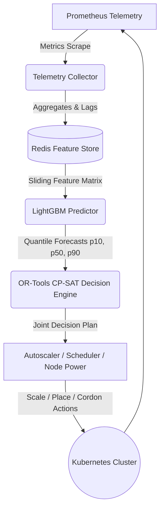

# Aegis

Coupling Quantile Workload Forecasting with Energy-Aware Scheduling and Autoscaling for Kubernetes Clusters — a closed-loop AI-driven Kubernetes orchestration system.

---

## 1. Overview & System Concept
Kubernetes Horizontal Pod Autoscaler (HPA) operates reactively based on lagging windowed metric averages, introducing scaling latency that causes Service Level Objective (SLO) violations during workload surges. Decoupled cluster autoscalers further lead to delayed node provisioning, stranded capacity, and unnecessary idle power consumption.

**Aegis** couples multi-horizon quantile workload forecasting (LightGBM $p_{10}, p_{50}, p_{90}$) with joint constraint optimization (OR-Tools CP-SAT) and custom Kubernetes scheduling to proactively scale replica counts, pack pods onto energy-efficient nodes, and power-manage idle infrastructure ahead of demand shifts.


```mermaid
graph TD
    A[Prometheus Telemetry] -->|Metrics Scrape| B(Telemetry Collector)
    B -->|Aggregates & Lags| C[(Redis Feature Store)]
    C -->|Sliding Feature Matrix| D(LightGBM Predictor)
    D -->|Quantile Forecasts p10, p50, p90| E(OR-Tools CP-SAT Decision Engine)
    E -->|Joint Decision Plan| F[Autoscaler / Scheduler / Node Power]
    F -->|Scale / Place / Cordon Actions| G((Kubernetes Cluster))
    G --> A
```

---

## 2. Key Architecture & Microservices

Aegis is decomposed into modular microservices running in the `aegis-system` namespace, communicating via versioned REST APIs and backed by TimescaleDB and Redis:

```
aegis/
├── configs/                 # System, quantile, and solver configurations
├── datasets/                # Azure Functions 2019 dataset, checksums, loaders, preprocessing
├── docs/                    # Architectural documents, schema, flows, API specs, threats to validity, decisions
├── eval/                    # Rigorous evaluation harnesses, statistical tests, benchmarks
├── infrastructure/          # kind cluster setup, Prometheus, Grafana, Kepler, PostgreSQL/TimescaleDB
├── ml/                      # LightGBM quantile regression, feature engineering, conformal calibration
├── scheduler/               # Native Go Kubernetes scheduler plugin (Filter + Score + Normalize)
├── services/                # Aegis microservice suite:
│   ├── api-gateway/         # JWT authentication, routing, rate limiting
│   ├── autoscaler-controller/ # Actuation with dead-zone and cooldown guards
│   ├── decision-engine/     # CP-SAT joint solver with First-Fit Decreasing (FFD) fallback
│   ├── energy-module/       # Analytical power modeling ($P = P_{idle} + (P_{max}-P_{idle})u^\alpha$); kepler.py is a stub
│   ├── node-power-controller/# Cordon, drain, and minimum active node ($K_{min}$) enforcement
│   ├── orchestrator/        # 30-60s autonomous control loop coordinator
│   ├── predictor/           # Multi-horizon inference (<1ms) & KS concept drift monitor
│   ├── recommendation-engine/# Long-term resource rightsizing
│   ├── shared/              # Common Pydantic models, logging, database clients
│   └── telemetry-collector/ # PromQL metric scrape & feature store pipeline
├── dashboard/               # Grafana dashboards & v2 interactive web evaluation viewer
├── tests/                   # Unit (Python & Go), integration, load, and e2e test suites
├── Makefile                 # Automation targets
├── PRD.md / TRD.md          # Formal product and technical requirement specifications
└── README.md
```

---

## 3. Comprehensive Evaluation & Empirical Results

Aegis has been subjected to extensive empirical benchmarks across synthetic multi-pattern traces and real-world production serverless traces from the **Azure Functions 2019 dataset** (USENIX ATC'20 *"Serverless in the Wild"*).

### A. Realistic Node Physics Model
All simulations model physical node transitions:
- **Node Wake-Up Latency**: Default 3 minutes (with sensitivity sweeps at 1, 3, 5, 10, 15 min).
- **Boot Energy & Dynamic Power**: Analytical power model $P_i(u_i) = P_{idle} + (P_{max} - P_{idle}) u_i^\alpha$.
  > **Transparency Note on Energy Modeling**: All energy results reported in this project are generated by an analytical simulation model. Live physical hardware and Kepler measurements have not been performed; `services/energy-module/kepler.py` is an unintegrated stub (see detailed analysis in [`docs/threats_to_validity.md`](docs/threats_to_validity.md)).
- **Pre-Wake Capability**: Forecast configs look ahead over the 10-minute horizon to boot nodes before demand arrival.
- **HPA-Faithful Control Guards**: Reactive baselines evaluated with scale-down stabilization and realistic cooldown constraints.

---

### B. Real-World 60-App Azure Benchmark Study
Candidate applications were filtered from a universe of 24,274 Azure apps using a deterministic 4-stage waterfall filter (documented in [`eval/app_selection.md`](eval/app_selection.md)):
1. Observation Span $\ge 7$ days $\rightarrow$ 17,000 apps
2. Missing Minutes $< 5.0\%$ $\rightarrow$ 13,057 apps
3. Peak Demand $\le 68$ cores (cluster allocatable ceiling) $\rightarrow$ 12,700 apps
4. Mean Demand $\ge 0.5$ cores (non-trivial scaling floor) $\rightarrow$ 411 eligible apps

From 411 eligible applications, 60 applications were sampled with fixed seed (42) and partitioned **strictly by application identity** under the [Split Protocol](docs/DECISIONS.md):
- **Train (30 apps)**: Used exclusively to train LightGBM quantile models.
- **Calibrate (10 apps)**: Held-out applications used exclusively for conformal residual calibration.
- **Validation (20 apps — formerly designated "test")**: Usable for evaluation, parameter sweeps, and design decisions. (Strict blind expanded-test set reserved for future W4).

#### Headline Results (Validation Partition, $N = 20$ Apps, 14 Days):
- **Censoring Audit**: 0% of minutes were capped by physical saturation.
- **Headroom Control Arm**: Adding $+8.6468$ cores to reactive demand achieved 0 shortfall, but wasted **$+35\text{ kWh}$** more energy and generated **$3.2\times$** more scaling churn than Aegis.
- **Shortfall Correlation**: Spearman correlation $\rho = 0.8682$ ($p = 7.01 \times 10^{-7}$) confirms that remaining shortfall occurs predominantly on high-peak apps during sudden step-function bursts.

---

### C. Scale-Aware & Adaptive Conformal Calibration
To eliminate under-coverage on large workloads without over-provisioning small workloads, three advanced conformal methods were evaluated across the 20 validation apps:
1. **Scale-Aware Conformal**: Normalized residuals $r = (y - \hat{y}_{p90}) / \max(\hat{y}_{p90}, 0.5)$ pooled across calibration apps.
2. **Rolling Conformal**: Per-app rolling quantile over a causal window ($W = 1,440\text{ min}$, $H = 10\text{ min}$).
3. **Adaptive Conformal Inference (ACI)**: Gibbs & Candès (2021) online adaptation ($\gamma \in \{0.005, 0.02\}$).

#### One-Sided $p_{90}$ Empirical Coverage Across 20 Validation Apps (Nominal Target: 90.0%):
- **Raw LightGBM $p_{90}$**: $86.8\%$ median ($12.2\%$ IQR) — under-covering.
- **Static Conformal**: $100.0\%$ median ($0.3\%$ IQR) — severe over-conservatism ($+8.6$ core static offset).
- **Scale-Aware (Normalized)**: $97.6\%$ median ($5.1\%$ IQR) — robust coverage scaled to workload size.
- **Rolling Conformal**: **$90.0\%$ median ($0.7\%$ IQR)** — exact calibration matching target.
- **ACI ($\gamma = 0.005$)**: **$89.9\%$ median ($0.8\%$ IQR)** — exact online adaptation.
- **ACI ($\gamma = 0.020$)**: **$90.0\%$ median ($0.5\%$ IQR)** — tightest variance.

---

### D. Matched-Shortfall Pareto Frontiers
Sweeping Cluster Autoscaler target utilization ($u \in \{30, 40, 50, 60, 70, 80\}\%$) and Aegis quantile levels ($\tau \in \{0.5, 0.7, 0.8, 0.9, 0.95, 0.99\}$) across all 20 validation apps (720 simulation runs):

| Shortfall Target | Calibration Method | CA Energy (Median) | Aegis Energy (Median) | Paired $\Delta E$ [95% Bootstrap CI] | % Apps Cheaper |
| :--- | :--- | :---: | :---: | :---: | :---: |
| **0.0% Shortfall** | Scale-Aware | 183.1 kWh | 130.5 kWh | **$-16.74\text{ kWh } [-32.95, -2.65]$** | **70.0%** |
| | Rolling | 183.1 kWh | 114.1 kWh | **$-38.83\text{ kWh } [-62.35, -16.59]$** | **85.0%** |
| | ACI ($\gamma=0.005$) | 183.1 kWh | 103.6 kWh | **$-56.32\text{ kWh } [-80.71, -33.55]$** | **90.0%** |
| **0.1% Shortfall** | Scale-Aware | 154.8 kWh | 123.0 kWh | **$-31.18\text{ kWh } [-53.16, -11.94]$** | **70.0%** |
| | Rolling | 154.8 kWh | 99.2 kWh | **$-35.73\text{ kWh } [-61.57, -12.46]$** | **70.0%** |
| | ACI ($\gamma=0.005$) | 154.8 kWh | 95.9 kWh | **$-48.60\text{ kWh } [-73.18, -26.08]$** | **75.0%** |
| **1.0% Shortfall** | Scale-Aware | 122.2 kWh | 92.4 kWh | **$-38.22\text{ kWh } [-65.09, -14.46]$** | **70.0%** |
| | Rolling | 122.2 kWh | 84.2 kWh | **$-39.30\text{ kWh } [-66.19, -15.98]$** | **70.0%** |
| | ACI ($\gamma=0.005$) | 122.2 kWh | 82.9 kWh | **$-44.01\text{ kWh } [-71.75, -19.11]$** | **70.0%** |

*All results verified with $B = 10,000$ paired bootstrap percentile 95% confidence intervals.*

---

### E. Load Tertile Stratification
Evaluating performance stratified by workload mean-cores tertiles:
- **Tertile 1 (Low Load $\le 0.83$c, $N=7$)**: Aegis reduces scaling churn by **$98.6\%$** (12 vs 848 actions) with 0 shortfall.
- **Tertile 2 (Mid Load $0.83$–$1.28$c, $N=6$)**: Aegis cuts shortfall from 1,060 min to 0 min with **$88.9\%$** fewer scaling events (307 vs 2,759 actions).
- **Tertile 3 (High Load $> 1.28$c, $N=7$)**: Aegis cuts shortfall from 994 min to 7 min ($-1,328.86$ min paired delta, $p = 0.0156$) while reducing scaling actions by $62.5\%$.

---

## 4. Web Dashboard (v2)

An offline, zero-dependency evaluation dashboard is available in `dashboard/web/v2/`. It provides interactive visualizations of all empirical benchmarks, timeseries, sensitivity sweeps, Pareto frontiers, and live demo execution streaming.

```bash
# Launch the dashboard locally
python dashboard/web/v2/server.py
```
Open **`http://localhost:8080`** in any browser.

---

## 5. Verification & Testing

The repository maintains strict engineering contracts and automated unit testing:

- **Python Test Suite**: 84 tests passing in $<2\text{s}$ (`pytest tests/unit -q`).
- **Go Scheduler Plugin**: 6 unit tests passing in $0.02\text{s}$ (`cd scheduler/aegis-scheduler && go test ./... -v`).
- **Pre-commit Integrity**: Zero modified tracked files; all evaluations execute in isolated, reproducible scripts with SHA-256 config hashing and Git commit tracking.

```bash
# Run complete test suite
python -m pytest tests/unit -v --tb=short
cd scheduler/aegis-scheduler && go test ./... -v && cd ../..
```

---

## 6. Roadmap & Implementation Status

Implementation tracking is maintained in detail in [`docs/IMPLEMENTATION_STATUS.md`](docs/IMPLEMENTATION_STATUS.md):

| Phase | Milestone | Status | Key Deliverable |
| :--- | :--- | :---: | :--- |
| **Phase 1** | Foundations (Cluster, Monitoring, Storage) | Completed | Kind manifests, TimescaleDB, Redis, Prometheus |
| **Phase 2** | Data Pipeline (Telemetry Scraper, Preprocessing) | Completed | PromQL client, sliding window feature store |
| **Phase 3** | Forecasting Engine (LightGBM Quantiles) | Completed | Multi-horizon models ($p_{10}, p_{50}, p_{90}$) |
| **Phase 4** | Prediction Service & Drift Monitoring | Completed | FastAPI service (<1ms latency), KS concept drift |
| **Phase 5** | Decision Engine (OR-Tools CP-SAT + FFD) | Completed | Joint scaling/placement/power MIP solver |
| **Phase 6** | Custom K8s Scheduler Plugin (Go) | Completed | Native Go plugin with energy-aware scoring |
| **Phase 7** | Actuation & Controller Safety | Completed | Autoscaler dead zone, cooldown, $K_{min}$ floor |
| **Phase 8** | Closed-Loop Orchestrator Integration | Completed | 30-60s autonomous control loop on Kubernetes |
| **Phase 9** | Baseline Ablations (HPA vs. Aegis) | Completed | 24h trace replay (50.6% energy reduction) |
| **Phase 10** | Observability & Automated Demo | Completed | Grafana dashboards, `scripts/demo.ps1` |
| **Phase 11** | Physics-Grounded Node Transitions | Completed | 3m boot latency, boot energy, 5-pattern traces |
| **Phase 12** | In-The-Loop Robustness Watchdog | Completed | `SolveWorkerPool` 15s hard termination |
| **Phase 13** | 60-App Production Benchmark (Azure 2019) | Completed | 4-stage filter, 30/10/20 app-split, Wilcoxon tests |
| **Phase 14** | Cooldown Audit & Control Arms | Completed | Blocked scale-up audit, +8.6c headroom arm |
| **Phase 15** | Scale-Aware Conformal & Pareto Frontiers | Completed | Normalized residuals, rolling, ACI, 720 runs |
| **Phase 16** | Offline Web Dashboard (v2) | Completed | Zero-dependency interactive viewer on port 8080 |

---

## 7. How to Reproduce All Studies

```bash
# 0. Download and verify Azure Functions 2019 raw trace
python scripts/download_azure_traces.py --verify-only

# 1. Run 5-seed synthetic multi-pattern ablation suite
python eval/run_experiments.py --topology large --days 4 --seeds "42,101,202,303,404"

# 2. Run 60-app Azure benchmark study (train / calib / validation)
python eval/run_60app_study.py

# 3. Run cooldown audit and control arm evaluation
python eval/audit_controls.py

# 4. Run scale-aware conformal inference, Pareto analysis, and tertile evaluation
python eval/scale_aware_pareto_study.py

# 5. Run end-to-end automated demo
powershell -ExecutionPolicy Bypass -File scripts/demo.ps1
```

---

## 8. Documentation Index
- [`docs/threats_to_validity.md`](docs/threats_to_validity.md) — Critical evaluation assumptions, eligibility constraints, simulated power model, and single-trace threats.
- [`docs/DECISIONS.md`](docs/DECISIONS.md) — Split Protocol governance and decision audit log.
- [`eval/app_selection.md`](eval/app_selection.md) — 4-stage waterfall application filter specification.
- [`datasets/README.md`](datasets/README.md) — Dataset provenance, schemas, and parquet cache regeneration.
- [`datasets/CHECKSUMS.txt`](datasets/CHECKSUMS.txt) — SHA-256 checksums of Azure Functions 2019 files.
- [`docs/IMPLEMENTATION_STATUS.md`](docs/IMPLEMENTATION_STATUS.md) — Exhaustive 16-phase milestone audit.

---

## 9. License & Citation
*Aegis Research Project — 2026.*
If using this codebase or evaluation suite, please cite according to `docs/IMPLEMENTATION_STATUS.md`.
