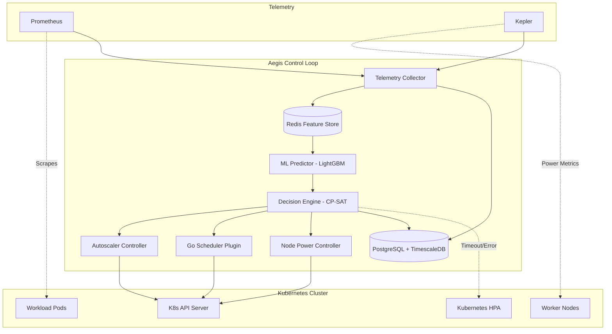

# Technical Requirements Document (TRD)

## 1. Architecture Overview

## 2. Microservice Decomposition
1. **API Gateway:** Entry point for UI/CLI, handles JWT auth & routing.
2. **Orchestrator:** Manages the 30-60s control loop cycle, invoking other services.
3. **Telemetry Collector:** Queries Prometheus/Kepler, computes aggregates, pushes to Redis/Postgres.
4. **Predictor:** Runs LightGBM inference via MLServer/ONNX, outputs p10/p50/p90 forecasts.
5. **Decision Engine:** Runs OR-Tools CP-SAT or FFD fallback to generate the optimal plan.
6. **Autoscaler Controller:** Translates replica plans into K8s Deployments/StatefulSets scales.
7. **Scheduler Plugin (Go):** K8s native scheduler plugin using Filter+Score based on predictions.
8. **Node Power Controller:** Issues cordon/drain/power-state commands.
9. **Recommendation Engine:** Generates rightsizing recommendations based on historical data.
10. **Energy Module:** Calibrates and maintains the energy model.
11. **Dashboard:** Frontend UI (Grafana/React) for observability.

## 3. Data Flow vs Control Flow
- **Data Flow:** Asynchronous streams of metrics. `Prometheus -> Collector -> Redis -> DB`.
- **Control Flow:** Synchronous 30-60s cycle driven by the Orchestrator triggering Predictor -> Decision Engine -> Execution.

## 4. Infrastructure & Monitoring
- **Platform:** kind (1 Control Plane + 3 Workers), Docker, Helm.
- **Monitoring:** Prometheus, Grafana, Kepler, kubelet/cAdvisor.
- **Storage:** Redis (Feature cache, TTL 1h, pub/sub), PostgreSQL with TimescaleDB extension (Audit, raw metrics hypertables).

## 5. Machine Learning
- **Model:** LightGBM Quantile Regression.
- **Outputs:** p10, p50, p90 quantiles.
- **Horizons:** 5, 10, 15 minutes.
- **Features:** CPU, mem, net, disk, HTTP rate, pod count, node util, time-of-day, day-of-week, weekend flag, rolling stats, AR lags.
- **Lifecycle:** KS test for drift detection, shadow deployments, ONNX export for inference.

## 6. Decision Engine & Energy Model
- **Solver:** OR-Tools CP-SAT with a configurable wall-clock timeout. Fallback to First-Fit Decreasing (FFD).
- **Variables:** Replica count, pod-to-node placement, node power state.
- **Objective:** Minimize Energy + SLO Violations + Scaling Slack.
- **Energy Model:** $P_i(u_i) = P_{idle,i} + (P_{max,i} - P_{idle,i}) \times u_i^\alpha$. Calibrated via Kepler.

## 7. Execution Systems
- **Scheduler Plugin:** Written in Go using K8s Scheduling Framework. Scoring: $w_1(1-predicted\_util) + w_2(-energy\_cost) + w_3(balance\_penalty)$.
- **Autoscaler:** Target Replicas = $ceil(p90\_forecast / per\_replica\_capacity)$. Applies ±10% dead zone and ≥5 min cooldown.
- **Fallback Paths:** Predictor failure uses last valid prediction. System failure triggers Kubernetes native HPA.

## 8. API & Observability
- **API:** Versioned REST (`/v1/...`), JWT Bearer token authentication.
- **Observability:** Structured JSON logging, Prometheus metrics for system health, health check endpoints.

## 9. Hardware & Deployment Constraints
- **Hardware:** CPU-friendly ML targeting NVIDIA RTX 3050 limitations (no massive cloud GPU required).
- **Deployment:** Dev on local `kind`. Staging optional on EKS/GKE.
