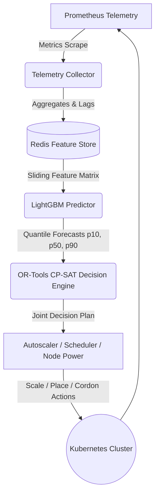

# Aegis

<div align="center">

### Predictive, Energy-Optimal Kubernetes Cloud Orchestration Engine

[](https://github.com/yashlund05/aegis-cloud/actions)
[](https://github.com/yashlund05/aegis-cloud/actions)
[](https://www.python.org/)
[](https://go.dev/)
[](https://kubernetes.io/)
[](https://developers.google.com/optimization)
[](https://lightgbm.readthedocs.io/)
[](LICENSE)

*Autonomous, closed-loop cloud infrastructure orchestrator coupling multi-horizon quantile forecasting, distribution-free conformal calibration, and mixed-integer linear programming (MILP) to minimize data center energy while enforcing strict capacity guarantees.*

[Architecture](#3-architecture-and-repository-layout) • [Evaluation Protocol](#4-evaluation-protocol) • [Headline Results](#5-headline-result--matched-shortfall-energy-v5) • [Reproducibility](#10-reproducibility) • [Contributors](#14-contributors-and-project-attribution)

</div>

---

{{overview_paragraph}}

---

## 1. Scope and Status Box

| | |
| :--- | :--- |
| **What is measured** | Conformal forecast coverage, cluster energy (kWh), capacity shortfall (minutes), and scaling actions for Aegis vs. a Cluster-Autoscaler-style reactive baseline and other arms, by replaying recorded workload traces through a frozen, unit-tested simulator (`ml/evaluation/ablation.py`). |
| **What is a simulation** | **Every energy number in this README** comes from an analytical power model $P_i(u_i) = P_{idle,i} + (P_{max,i} - P_{idle,i})\,u_i^{\alpha}$ with 3-minute node boot transitions and a $K_{\min} = {{kmin_nodes}}$-node floor. No physical power meter, IPMI, or Kepler measurement is involved anywhere. |
| **What is not done** | Live hardware/Kepler energy validation (`services/energy-module/kepler.py` is an unintegrated stub); a blind evaluation on the reserved expanded-test partition (W4 — pending); online closed-loop deployment on a physical cluster. |

## 2. Honest Limitations (Read Before Citing Any Number)

- **All energy is analytical simulation.** No live physical hardware or Kepler measurement has been performed; `services/energy-module/kepler.py` is an unintegrated stub (see `docs/threats_to_validity.md` §3).
- **Demand cores are derived, not measured CPU.** Per-minute cores are computed from Azure serverless invocation counts times the *daily mean* execution duration times an assumed 1.0 vCPU per concurrent execution: $\text{cores}(app,t) = \sum_f \text{invocations}(f,t) \times \overline{\text{dur}}_s(f,\text{day}) / 1000 / 60 \times 1.0$. Real I/O-bound functions typically use less than 1.0 vCPU; daily duration averaging hides intraday latency variance (see `docs/threats_to_validity.md` §1).
- **Single trace, heavy filtering.** One 14-day production trace (Azure Functions 2019, July 2019). Only {{n_eligible_apps}} of {{n_raw_apps}} raw applications ({{pct_eligible}}%) pass the 4-stage eligibility filter, so results describe continuously active, medium-to-large workloads — not the dormant serverless long tail.
- **The 20 validation apps are not blind.** They were used for design decisions, parameter sweeps, and calibration-method selection under the Split Protocol. Results on them are development-set results. The zero-touch blind evaluation on the reserved expanded-test partition (W4) has not been run; until then no generalization claim beyond these 20 apps is supported.

## 3. Architecture and Repository Layout

Aegis couples multi-horizon quantile workload forecasting (LightGBM $p_{10}, p_{50}, p_{90}$) with joint constraint optimization (OR-Tools CP-SAT) and a custom Kubernetes scheduler plugin to scale replicas, pack pods onto energy-efficient nodes, and power-manage idle nodes ahead of demand shifts. An autonomous orchestrator loop closes the cycle: Prometheus telemetry → Redis feature store → LightGBM predictor → CP-SAT decision engine → autoscaler/scheduler/node-power actuation.



### Microservice Subsystems

| Microservice | Primary Role | Implementation Path |
| :--- | :--- | :--- |
| **API Gateway** | External ingress routing, rate limiting, and centralized JWT validation | `services/api-gateway` |
| **Orchestrator** | Closed-loop control coordinator executing end-to-end reconciliation cycles | `services/orchestrator` |
| **Telemetry Collector** | Prometheus scraper with lag calculation and Redis feature storage | `services/telemetry-collector` |
| **Predictor Service** | LightGBM quantile inference, shadow model routing, and drift detection | `services/predictor` |
| **Decision Engine** | OR-Tools CP-SAT joint optimizer with First-Fit Decreasing fallback | `services/decision-engine` |
| **Autoscaler Controller** | Safe Kubernetes replica scaling with rate limits and cooldown guards | `services/autoscaler-controller` |
| **Node Power Controller** | Node power state actuation with capacity safety invariants | `services/node-power-controller` |
| **Recommendation Engine** | Advisory placement and rightsizing recommendation generator | `services/recommendation-engine` |
| **Energy Module** | Calibrated power modeling and energy consumption estimation | `services/energy-module` |
| **Aegis Scheduler** | Native Kubernetes scheduler plugin extending Filter and Score points | `scheduler/aegis-scheduler` |

```
{{repo_tree}}
```

Every path above is verified to exist by `eval/generate_readme.py` at build time.

## 4. Evaluation Protocol

### 4.1 Workload selection (Azure Functions 2019)

Applications are filtered from the raw trace by a deterministic 4-stage waterfall
(Source: `eval/app_selection.md` §3, "Filter Cascade & Drop Accounting"; 14-day trace = {{trace_days}} days):

| Stage | Criterion | Apps passing | Apps dropped |
| :--- | :--- | ---: | ---: |
| Raw universe | — | {{wf_raw}} | 0 |
| 1 | Observation span ≥ 7 days | {{wf1_pass}} | {{wf1_drop}} |
| 2 | Missing minutes < 5.0% | {{wf2_pass}} | {{wf2_drop}} |
| 3 | Peak demand ≤ 68.0 cores | {{wf3_pass}} | {{wf3_drop}} |
| 4 | Mean demand ≥ 0.50 cores | {{wf4_pass}} | {{wf4_drop}} |

From the {{wf4_pass}} eligible applications, {{n_total_apps}} are sampled with fixed seed {{selection_seed}} and partitioned strictly by application identity (Source: `eval/sixty_app_study_results.json`, `configuration`): **{{n_train_apps}} train** (LightGBM quantile training), **{{n_calib_apps}} calibrate** (conformal residuals), **{{n_validation_apps}} validation**. The 20 validation apps are the evaluation set for every number below. They are *not* a blind test set (see §2). A further expanded-test partition is reserved for the pending W4 evaluation and was not touched by any study here.

### 4.2 Simulator invariants

(Source: `eval/sixty_app_study_results.json` → `configuration`; `eval/headline_results_v5.json` and `eval/baselines_results_v1.json` → `configuration.energy_floor_kwh`; node power from `ml/evaluation/ablation.py::get_default_nodes(scale="large")`.)

- Cluster: {{node_count}} nodes × {{cores_per_node}} cores/node × {{alloc_factor}} allocatable = {{allocatable_cores}} allocatable cores.
- Node power (per-node heterogeneous, not uniform): $P_{idle}$ = {{p_idle_min}}–{{p_idle_max}} W, $P_{max}$ = {{p_max_min}}–{{p_max_max}} W, exponent $\alpha$ = {{alpha}}. Note: several project documents describe a nominal "P_idle = 100 W, P_max = 300 W" profile; the committed code implements the heterogeneous ranges above (see `docs/README_regen_discrepancies.md`, item h).
- Guards: {{dead_zone_pct}}% scale dead zone, {{cooldown_s}} s scale cooldown, {{boot_min}}-minute node wake-up latency, $K_{\min}$ = {{kmin_nodes}} minimum active nodes.
- Energy floor: {{energy_floor_kwh}} kWh = $K_{\min} \times$ {{floor_watts}} W × {{floor_hours}} h — energy at or below the two-idle-node floor is reported separately as "above floor".
- Scored evaluation window: {{eval_window_min}} minutes ({{eval_window_days}} days) of the {{trace_days}}-day trace (the first day is feature warm-up).
- Statistics: paired bootstrap {{ci_level}}% CIs with B = {{bootstrap_b}}, Wilcoxon signed-rank tests with Holm–Bonferroni correction within each comparison family.

### 4.3 Frontier grids

CA target utilizations: {{n_ca_utils}} points ({{ca_grid_range}}); Aegis quantile levels $\tau$: {{n_taus}} points ({{tau_grid_range}}); shortfall targets: {{n_targets_pct}} ({{shortfall_targets}}); study arms: {{n_arms}}. Each (utilization × τ × app) pairing is a frontier evaluation point: {{n_frontier_points}} per target across the {{n_validation_apps}} validation apps. The original narrower v1 grid (6 × 6 points) is retained as a subset (Decision D-5).

**Superseded result files:** `eval/scale_aware_pareto_results.json` (v1), `eval/scale_aware_pareto_results_v3.json` (v3), and `eval/headline_results_v4.json` (v4) are superseded by `eval/headline_results_v5.json` per Decision D-10 and feed **no** number in this README.

## 5. Headline Result — Matched-Shortfall Energy (v5)

**Primary comparison**: Aegis with per-app rolling conformal calibration (W = {{rolling_w}}, H = {{rolling_h}}; primary arm per Decision D-7) vs. Cluster Autoscaler (CA), at the **primary 1.0% shortfall target** ({{t10_minutes}} min of the {{eval_window_min}}-minute window; lowest extrapolation rate per Decision D-6).
ΔE = $E_{\text{Aegis}} - E_{\text{CA}}$ per app; negative = Aegis cheaper. "Mean ΔE" is the all-app mean paired difference; "median" columns are marginal medians.

At the 1.0% target (Source: `eval/headline_results_v5.json` → `matched_shortfall_pareto['1.0%']['rolling']`; Wilcoxon fields cross-checked identical in `eval/baselines_results_v1.json` → same path):

- CA median energy: {{hl_ca_med}} kWh; Aegis median energy: {{hl_aegis_med}} kWh; difference of medians: {{hl_med_diff}} kWh.
- **Mean paired ΔE: {{hl_mean_delta}} kWh, {{ci_level}}% bootstrap CI [{{hl_ci_lo}}, {{hl_ci_hi}}]** — the CI excludes zero.
- Apps cheaper with Aegis: {{hl_cheaper_pct}}% ({{hl_cheaper_n}} of {{n_validation_apps}}).
- Extrapolation: CA frontier interpolated at target for {{hl_ca_extrap}}/{{n_validation_apps}} apps ({{hl_ca_below}} below-min, {{hl_ca_above}} above-max); Aegis for {{hl_aegis_extrap}}/{{n_validation_apps}} apps ({{hl_aegis_below}} below-min, {{hl_aegis_above}} above-max). Degenerate Aegis frontiers: {{hl_degenerate}}/{{n_validation_apps}}.
- **Wilcoxon two-sided p = {{hl_p2}}; Holm–Bonferroni-adjusted (across {{n_arms}} arms at this target) p = {{hl_holm}}.** Stated plainly: the bootstrap CI excludes zero, but the Holm-adjusted p is {{hl_holm_cmp}} {{sig_level}}, so the rank-based paired test with family correction does **not** reach the {{sig_level}} threshold. Both facts are reported; neither alone is the result.

### 5.1 Secondary and supplementary targets (primary arm, rolling conformal)

(Source: `eval/headline_results_v5.json` → `matched_shortfall_pareto[<target>]['rolling']`; Holm-adjusted p from `eval/baselines_results_v1.json` → same path, correction across the {{n_arms}} study arms at each target.)

| Target | Role | CA median (kWh) | Aegis median (kWh) | Mean ΔE (kWh) [{{ci_level}}% CI] | Cheaper | Holm-adj. p |
| :--- | :--- | ---: | ---: | :--- | ---: | ---: |
| {{t01_label}} | Secondary (strict SLA) | {{t01_ca}} | {{t01_ae}} | {{t01_delta}} [{{t01_lo}}, {{t01_hi}}] | {{t01_cheaper}}% | {{t01_holm}} |
| {{t10_label}} | **Primary** | {{t10_ca}} | {{t10_ae}} | {{t10_delta}} [{{t10_lo}}, {{t10_hi}}] | {{t10_cheaper}}% | {{t10_holm}} |
| {{t50_label}} | Supplementary (upper bound) | {{t50_ca}} | {{t50_ae}} | {{t50_delta}} [{{t50_lo}}, {{t50_hi}}] | {{t50_cheaper}}% | {{t50_holm}} |

At the 0.1% and 5.0% targets the mean-ΔE CIs again exclude zero while the Holm-adjusted p-values ({{t01_holm}} and {{t50_holm}}) exceed {{sig_level}}; the same plain statement applies. The 0.0% target (zero shortfall) is **extrapolation-dominated**: CA requires frontier extrapolation for {{t00_ca_extrap}}/{{n_validation_apps}} apps and Aegis for {{t00_ae_extrap}}/{{n_validation_apps}} apps, and every remaining extrapolation is below the minimum achievable shortfall (target 0 min < minimum observed shortfall on bursty apps). Its numbers (mean ΔE {{t00_delta}} [{{t00_lo}}, {{t00_hi}}], Holm-adj. p {{t00_holm}}) are shown for completeness only and should not be read as a robust operating point. Source: `matched_shortfall_pareto['0.0%']['rolling']`.

## 6. Natural Operating Point ($\tau$ = {{nop_tau}} vs. CA U = {{ca_u_50_label}}% / {{ca_u_60_label}}%)

Aegis running at its nominal quantile $\tau$ = {{nop_tau}} against CA at industrial-style utilization targets — the comparison without frontier interpolation.
(Source: `eval/headline_results_v5.json` → `natural_operating_points['rolling'][ca_u_50 | ca_u_60]`.)

| CA target | CA median energy (kWh) | Aegis median energy (kWh) | Mean ΔE (kWh) [{{ci_level}}% CI] | CA median shortfall (min) | Aegis median shortfall (min) | Mean Δ shortfall (min) [{{ci_level}}% CI] | Holm-adj. p |
| :--- | ---: | ---: | :--- | ---: | ---: | :--- | ---: |
| U = {{ca_u_50_label}}% | {{nop50_ca_e}} | {{nop50_ae_e}} | {{nop50_de}} [{{nop50_elo}}, {{nop50_ehi}}] | {{nop50_ca_s}} | {{nop50_ae_s}} | {{nop50_ds}} [{{nop50_slo}}, {{nop50_shi}}] | {{nop50_p}} |
| U = {{ca_u_60_label}}% | {{nop60_ca_e}} | {{nop60_ae_e}} | {{nop60_de}} [{{nop60_elo}}, {{nop60_ehi}}] | {{nop60_ca_s}} | {{nop60_ae_s}} | {{nop60_ds}} [{{nop60_slo}}, {{nop60_shi}}] | {{nop60_p}} |

Read the shortfall columns: at $\tau$ = {{nop_tau}} Aegis does **not** achieve zero shortfall (median {{nop50_ae_s}} min per app at U = {{ca_u_50_label}}%; mean paired shortfall reduction {{nop50_ds}} min). At U = {{ca_u_60_label}}% the mean energy ΔE CI is [{{nop60_elo}}, {{nop60_ehi}}], which includes zero, while the Holm-adjusted p is {{nop60_p}} (below {{sig_level}}); both are reported as-is.

## 7. Baselines and Component Ablations (Task W3)

Paired comparison of the primary rolling-conformal Aegis arm against each alternative arm at matched shortfall targets.
ΔE = $E_{\text{Aegis rolling}} - E_{\text{arm}}$ per app; **positive = Aegis costs more than that arm**.
(Source: `eval/baselines_results_v1.json` → `matched_shortfall_pareto[<target>]['vs_primary_aegis_rolling'][<arm>]`; degenerate-frontier counts from the corresponding arm block. p-values are unadjusted two-sided Wilcoxon; the committed file does not store a Holm correction for this comparison family.)

| Arm | ΔE @ 0.1% (kWh) [{{ci_level}}% CI] | ΔE @ 1.0% (kWh) [{{ci_level}}% CI] | p @ 0.1% | p @ 1.0% | Degenerate frontiers (0.1% / 1.0%) |
| :--- | :--- | :--- | ---: | ---: | :---: |
| LightGBM point (p50) + rolling conformal | {{b_lgbm_01}} [{{b_lgbm_01lo}}, {{b_lgbm_01hi}}] | {{b_lgbm_10}} [{{b_lgbm_10lo}}, {{b_lgbm_10hi}}] | {{b_lgbm_p01}} | {{b_lgbm_p10}} | {{b_lgbm_deg01}} / {{b_lgbm_deg10}} |
| Holt-Winters + rolling conformal | {{b_hw_01}} [{{b_hw_01lo}}, {{b_hw_01hi}}] | {{b_hw_10}} [{{b_hw_10lo}}, {{b_hw_10hi}}] | {{b_hw_p01}} | {{b_hw_p10}} | {{b_hw_deg01}} / {{b_hw_deg10}} |
| Fixed margin (raw p90 + {{fixed_margin_max}}-core sweep) | {{b_fm_01}} [{{b_fm_01lo}}, {{b_fm_01hi}}] | {{b_fm_10}} [{{b_fm_10lo}}, {{b_fm_10hi}}] | {{b_fm_p01}} | {{b_fm_p10}} | {{b_fm_deg01}} / {{b_fm_deg10}} |
| Seasonal naive + rolling conformal | {{b_sn_01}} [{{b_sn_01lo}}, {{b_sn_01hi}}] | {{b_sn_10}} [{{b_sn_10lo}}, {{b_sn_10hi}}] | {{b_sn_p01}} | {{b_sn_p10}} | {{b_sn_deg01}} / {{b_sn_deg10}} |
| Quantile linear + rolling conformal | {{b_ql_01}} [{{b_ql_01lo}}, {{b_ql_01hi}}] | {{b_ql_10}} [{{b_ql_10lo}}, {{b_ql_10hi}}] | {{b_ql_p01}} | {{b_ql_p10}} | {{b_ql_deg01}} / {{b_ql_deg10}} |
| No CP-SAT (spreading placement) | {{b_ffd_01}} [{{b_ffd_01lo}}, {{b_ffd_01hi}}] | {{b_ffd_10}} [{{b_ffd_10lo}}, {{b_ffd_10hi}}] | {{b_ffd_p01}} | {{b_ffd_p10}} | {{b_ffd_deg01}} / {{b_ffd_deg10}} |

**What this does and does not show (N = {{n_validation_apps}} per comparison; CIs are bootstrap percentile intervals):**

- The LightGBM quantile arm is **statistically indistinguishable** from point forecast (p50) + conformal, Holt-Winters + conformal, and a fixed margin at both matched targets: all three CIs include zero (e.g. {{b_lgbm_10}} [{{b_lgbm_10lo}}, {{b_lgbm_10hi}}] at 1.0%). With N = {{n_validation_apps}}, equivalence is not proven either — the study cannot tell these forecasters apart on matched-shortfall energy.
- The **CP-SAT placement stage has a measurable effect**: with the joint-placement optimizer bypassed (`no_cpsat_ffd`, replaced by even-spreading placement), the arm's energy sits {{b_ffd_cost}} kWh [{{b_ffd_cost_lo}}, {{b_ffd_cost_hi}}] above the primary Aegis arm at the 1.0% target — a CI that excludes zero.
- The conformal wrapper's measurable effect is **coverage control** (§8: rolling calibration holds median coverage near the {{nominal_coverage}}% nominal level where the raw $p_{90}$ under-covers at {{cov_raw_med}}%), not a demonstrated energy gain over a well-chosen fixed margin at matched shortfall: the fixed-margin CI vs. Aegis includes zero at both targets.
- `quantile_linear` has **degenerate frontiers on {{b_ql_deg10}} of {{n_validation_apps}} apps** at the 1.0% target ({{b_ql_deg01}}/{{n_validation_apps}} at 0.1%), so its rows should not be over-interpreted.
- The W3 clean-clone reproduction reproduced this table exactly (§10).

Naming note: the `no_cpsat_ffd` arm name is misleading — in the offline simulator this arm bypasses the joint-placement optimizer and uses *even spreading* (`_pack_pods(opt=False)`), not consolidating FFD bin-packing (see `docs/README_regen_discrepancies.md`, item b).

## 8. Conformal Calibration Comparison (Median Coverage, 20 Validation Apps)

One-sided $p_{90}$ empirical coverage over the 14-day window; nominal target 90.0%.
(Source: `eval/headline_results_v5.json` → `coverage_summary.median_iqr[<method>]`; rolling values reflect the causal finite-sample v4 formulation adopted in Decision D-9.)

| Method | Median coverage | IQR | Role |
| :--- | ---: | ---: | :--- |
| Raw LightGBM $p_{90}$ (no conformal) | {{cov_raw_med}}% | {{cov_raw_iqr}}% | Baseline — under-covers |
| Static split conformal | {{cov_static_med}}% | {{cov_static_iqr}}% | Ablation — over-conservative (+{{static_offset}}-core static offset) |
| Scale-aware (normalized residuals) | {{cov_sa_med}}% | {{cov_sa_iqr}}% | Variant |
| **Rolling conformal (W = {{rolling_w}}, H = {{rolling_h}})** | {{cov_roll_med}}% | {{cov_roll_iqr}}% | **Primary arm (D-7)** |
| ACI ($\gamma$ = {{aci_g1}}) | {{cov_a5_med}}% | {{cov_a5_iqr}}% | Variant |
| ACI ($\gamma$ = {{aci_g2}}) | {{cov_a20_med}}% | {{cov_a20_iqr}}% | Variant |

Censoring audit: {{censor_pct}}% of validation-app minutes were capped by physical saturation (Source: `eval/sixty_app_study_results.json` → `censoring_audit`, max `censored_fraction_pct` across {{n_validation_apps}} apps).

## 9. Load Tertiles

Apps are ranked by mean cores and split into tertiles of {{tert_low}} / {{tert_mid}} / {{tert_high}} apps (low / mid / high load).
(Source: `eval/headline_results_v5.json` → `app_partition.tertiles` for counts and `matched_shortfall_pareto['1.0%']['rolling'].tertiles` for matched-target energy; shortfall medians from `natural_operating_points['rolling'][ca_u_50].tertiles` — the v5 file contains no shortfall fields for the matched-target tertile tables, see `docs/README_regen_discrepancies.md`, item i.)

Matched 1.0% target, rolling conformal (ΔE = $E_{\text{Aegis}} - E_{\text{CA}}$):

| Tertile | N | CA median (kWh) | Aegis median (kWh) | Mean ΔE (kWh) [{{ci_level}}% CI] | Cheaper |
| :--- | ---: | ---: | ---: | :--- | ---: |
| Low load | {{tert_low}} | {{mt_low_ca}} | {{mt_low_ae}} | {{mt_low_de}} [{{mt_low_lo}}, {{mt_low_hi}}] | {{mt_low_ch}}% |
| Mid load | {{tert_mid}} | {{mt_mid_ca}} | {{mt_mid_ae}} | {{mt_mid_de}} [{{mt_mid_lo}}, {{mt_mid_hi}}] | {{mt_mid_ch}}% |
| High load | {{tert_high}} | {{mt_high_ca}} | {{mt_high_ae}} | {{mt_high_de}} [{{mt_high_lo}}, {{mt_high_hi}}] | {{mt_high_ch}}% |

On low-load apps the mean ΔE CI ({{mt_low_de}} [{{mt_low_lo}}, {{mt_low_hi}}]) includes zero and the Aegis median is slightly *higher* than CA — the energy benefit is concentrated in mid- and high-load apps.

Median shortfall per app at the natural operating point (Aegis $\tau$ = 0.90, CA U = {{ca_u_50_label}}%; mean paired Δ shortfall [{{ci_level}}% CI]):

| Tertile | CA median shortfall (min) | Aegis median shortfall (min) | Mean Δ shortfall (min) [{{ci_level}}% CI] |
| :--- | ---: | ---: | :--- |
| Low load | {{st_low_ca}} | {{st_low_ae}} | {{st_low_de}} [{{st_low_lo}}, {{st_low_hi}}] |
| Mid load | {{st_mid_ca}} | {{st_mid_ae}} | {{st_mid_de}} [{{st_mid_lo}}, {{st_mid_hi}}] |
| High load | {{st_high_ca}} | {{st_high_ae}} | {{st_high_de}} [{{st_high_lo}}, {{st_high_hi}}] |

## 10. Reproducibility

```bash
# 0. Download and checksum-verify the Azure Functions 2019 raw trace
python scripts/download_azure_traces.py --verify-only

# 1. Synthetic multi-pattern ablation suite (5 seeds)
python eval/run_experiments.py --seeds {{synth_seeds}} --output eval

# 2. 60-app study (selection, calibration, censoring audit)
python eval/run_60app_study.py

# 3. Cooldown audit and control arms (headroom arm, Spearman correlation)
python eval/audit_controls.py

# 4. v5 headline benchmark (all tables in §5, §6, §8, §9)
python eval/headline_study_v4.py

# 5. W3 baselines and ablations (§7)
python eval/baselines_study.py

# 6. Regenerate this README from the committed result files
make readme   # = python eval/generate_readme.py (runs the test suites live, then rebuilds)

# 7. Verify every number in this README against the JSON sources
python eval/check_report_numbers.py --readme
```

Verification results (all parsed from committed report files by `eval/generate_readme.py`):

- **Clean-clone reproduction (W3b)**: the full {{n_arms}}-arm baselines study re-run from a fresh clone of the result commit produced `eval/baselines_results_v1_repro.json`; a structured diff of {{repro_fields}} numeric fields across {{repro_comparisons}} arm × target/subsection comparisons found **max |v1 − repro| = {{repro_max_diff}}**; only `timestamp_utc` and `git_commit` differ. (Source: `eval/reports/repro_diff.txt`.)
- **Mutation check (W3b)**: {{mutation_verdict}} — a deliberately mutated tree in which `no_cpsat_ffd` calls the joint-placement solver is caught by the test suite; the pristine and reverted trees pass. (Source: `eval/reports/mutation_check.txt`.)
- **Artifact audit (W3b)**: clean-checkout audit found no missing repo files on the study's loading path and no uncommitted model artifacts post-fix; the study process tree opened `ml/models/registry.json` 0 times. (Source: `eval/reports/artifacts_audit.txt`.) Three earlier audit runs failed before completion (LightGBM CRLF model-load crash; a `sys.path` probe bug and a Windows reserved-device-path `relpath` crash; a sitecustomize log-directory bug) — all fixed and recorded in Decision D-12.
- **Provenance stamping**: every result file embeds `git_commit`, `dirty_flag` (all False for the files used here), a SHA-256 `config_hash`, and the simulator config hash.

## 11. Decision Log Summary

Full text, rationale, and candidates-tried for every entry: [`docs/DECISIONS.md`](docs/DECISIONS.md).

{{decision_log_rows}}

## 12. Implementation Status

Phase summaries from [`docs/IMPLEMENTATION_STATUS.md`](docs/IMPLEMENTATION_STATUS.md); W-task records from [`docs/DECISIONS.md`](docs/DECISIONS.md). (That document's heading says "Phases 1 through 10" but lists Phases 1–16; see `docs/README_regen_discrepancies.md`, item g.)

| Item | Title | Status | Note |
| :--- | :--- | :--- | :--- |
{{status_rows}}
| **W4** | Blind expanded-test evaluation | **Pending** | The reserved expanded-test partition has not been touched; no blind results exist. |

## 13. Dashboard, Tests, Makefile, License

- **Offline evaluation dashboard (v2)**: `python dashboard/web/v2/server.py`, then open `http://localhost:{{dashboard_port}}`. Zero-dependency HTML5/Canvas viewer for the study timeseries, Pareto frontiers, and sensitivity sweeps.
- **Python unit tests**: `python -m pytest tests/unit -q` → **{{pytest_passed}} passed** in {{pytest_seconds}} s (this README's counts are re-run live at build time, never copied).
- **Go scheduler plugin**: `cd scheduler/aegis-scheduler && go test ./...` → **{{go_passed}} tests passing**.
- **Makefile**: `make readme` (regenerate + verify this README), `make test` (pytest + go test), `make infra-up` / `make services-up` (local kind stack), `make help` for all targets.
- **License**: not yet determined — see [`LICENSE`](LICENSE) ("License: TBD"). Contact the maintainers before reuse or redistribution.
- **Citation**: cite the repository and the Azure Functions 2019 dataset (Shahrad et al., USENIX ATC'20, *"Serverless in the Wild"*); see `docs/IMPLEMENTATION_STATUS.md`.

## 14. Contributors and Project Attribution

Aegis is collaboratively designed and engineered by the Aegis Systems and Research Team:

- **Ayush Vishwakarma** ([`@officialayush5839-arch`](https://github.com/officialayush5839-arch)) — Systems Engineering & CI/CD Infrastructure Lead
- **Yash Lund** ([`@yashlund05`](https://github.com/yashlund05)) — Project Creator, Core Architect & Lead Researcher
- **Saim Kotkar** ([`@kotkarsaim-sketch`](https://github.com/kotkarsaim-sketch)) — Power Modeling & Evaluation Specialist
- **Sabiha Mulla** — Project Documentation & Progress Tracking

For a comprehensive log of individual roles, subsystem ownership, and git commit history, see [`CONTRIBUTORS.md`](CONTRIBUTORS.md).

---

## Provenance Footer

Generated by `eval/generate_readme.py` from `docs/README.template.md` — no number in this file was typed by hand; each is computed from the committed result files listed below and verified by `python eval/check_report_numbers.py --readme`.

- Repository HEAD at generation time: `{{git_head}}`
- Template SHA-256: `{{template_sha}}`

| Source file | Embedded git_commit | dirty_flag | config_hash (SHA-256, truncated) |
| :--- | :--- | :--- | :--- |
{{provenance_rows}}

Superseded files (Decision D-10), not used by this README: `eval/scale_aware_pareto_results.json` (v1), `eval/scale_aware_pareto_results_v3.json` (v3), `eval/headline_results_v4.json` (v4). Known reporting discrepancies are logged in [`docs/README_regen_discrepancies.md`](docs/README_regen_discrepancies.md).
