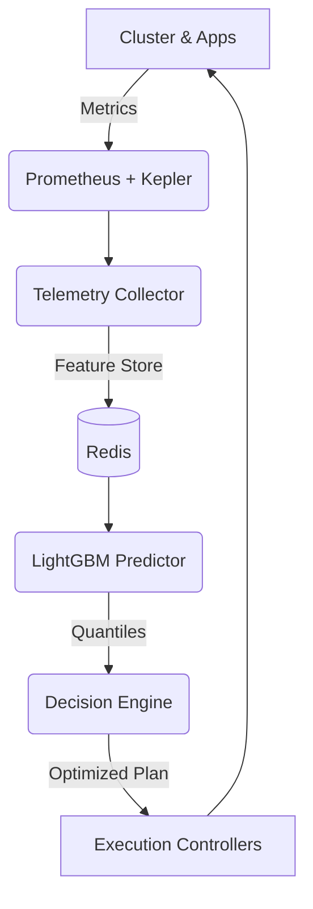
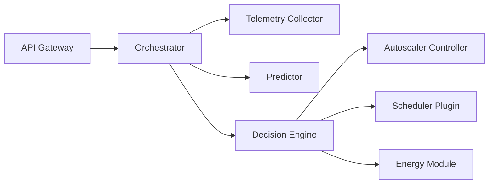

# Architecture Overview

## High-Level Control Loop

## Microservice Decomposition

## Deployment Architecture
Aegis components are designed to run alongside the target cluster or within a dedicated management cluster. The system uses a centralized database (TimescaleDB) for historical data and a Redis cache for rapid control-loop telemetry access.
